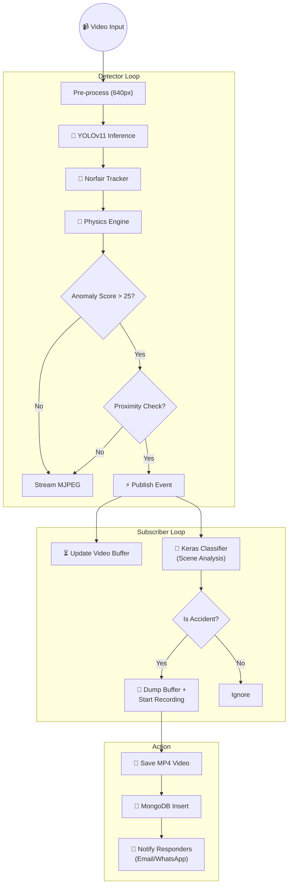

# Data Processing Pipeline

The journey of a video frame from camera to alert.

## Key Pipeline Concepts

1.  **Physics-First Detection**: We don't wait for a visual "crunch". We detect the *kinetic energy* changes (sudden deceleration) that precede or accompany a crash.
2.  **Temporal Consistency**: A crash isn't a single frame. The system uses a sliding window (history buffer) to ensure a crash persists before alerting.
3.  **Contextual Recording**: By buffering 5 seconds of video *before* the trigger, we capture the "cause" of the accident, not just the aftermath.
