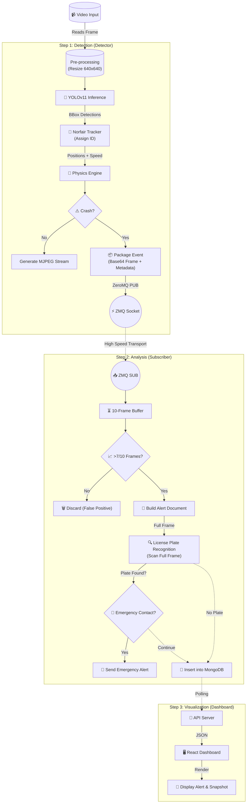

# Data Processing Pipeline

This diagram illustrates the step-by-step journey of a single video frame through the Accident Detection System.

```mermaid
graph TD
    %% 1. Input Stage
    Input[("📹 Video Input")] -->|Reads Frame| Resize[("Pre-processing<br>(Resize 640x640)")]
    
    %% 2. Detection Stage (The "Brain")
    subgraph Detector_Publisher ["Step 1: Detection (Detector)"]
        Resize --> Inference["🤖 YOLOv11 Inference"]
        Inference -->|BBox Detections| Tracker["🎯 Norfair Tracker<br>(Assign ID)"]
        Tracker -->|Positions + Speed| Physics["🧮 Physics Engine"]
        
        Physics --> Check{"⚠️ Crash?"}
        Check -->|No| StreamOnly["Generate MJPEG Stream"]
        Check -->|Yes| Pack["📦 Package Event<br>(Base64 Frame + Metadata)"]
        
        Pack -->|ZeroMQ PUB| ZMQ(("⚡ ZMQ Socket"))
    end

    %% 3. Transmission
    ZMQ -.->|High Speed Transport| Subscriber_In(("📥 ZMQ SUB"))

    %% 4. Subscriber Stage (The "Clerk")
    subgraph Classifier_Subscriber ["Step 2: Analysis (Subscriber)"]
        Subscriber_In --> Buffer["⏳ 10-Frame Buffer"]
        Buffer --> Threshold{"📈 >7/10 Frames?"}
        
        Threshold -->|No| Discard["🗑️ Discard (False Positive)"]
        Threshold -->|Yes| BuildDoc["📝 Build Alert Document"]
        
        BuildDoc -->|Full Frame| LPR["🔍 License Plate Recognition<br>(Scan Full Frame)"]
        LPR -->|Plate Found?| ContactCheck{"📒 Emergency Contact?"}
        ContactCheck -->|Yes| AlertSMS["📲 Send Emergency Alert"]
        ContactCheck -.->|Continue| DB_Write["💾 Insert into MongoDB"]
        LPR -.->|No Plate| DB_Write
    end

    %% 5. Visualization Stage
    subgraph Frontend ["Step 3: Visualization (Dashboard)"]
        DB_Write -.->|Polling| API["🔌 API Server"]
        API -->|JSON| UI["🖥️ React Dashboard"]
        UI -->|Render| AlertCard["🚨 Display Alert & Snapshot"]
    end
```
