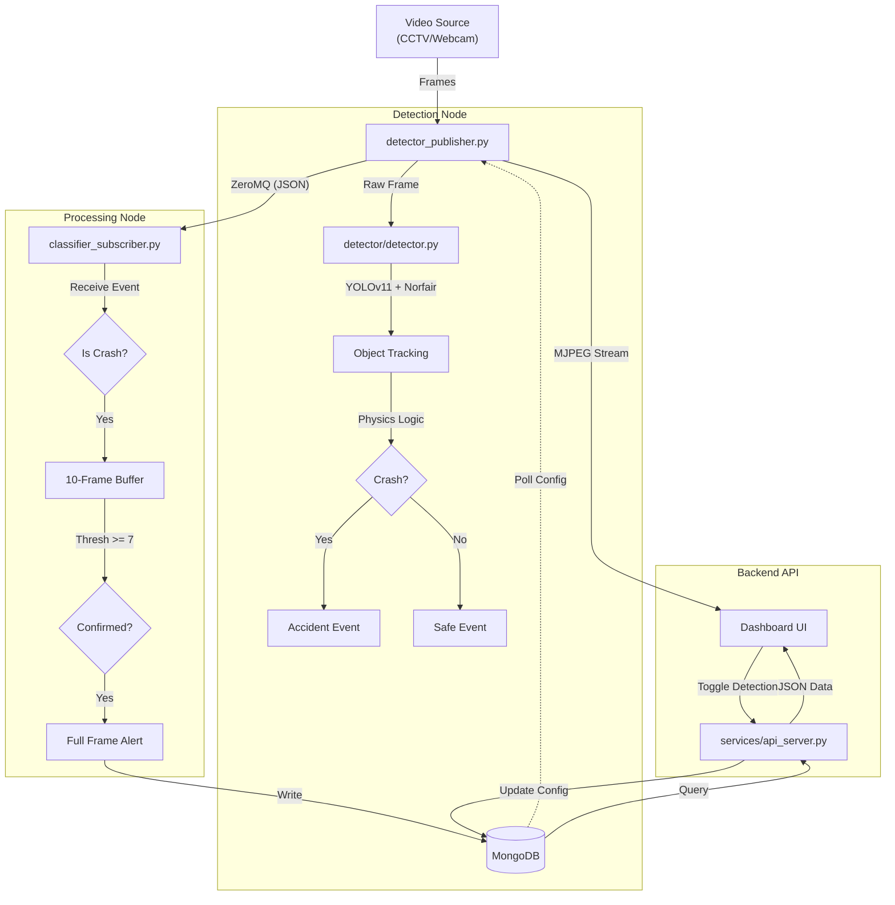

# System Architecture & Data Flow

This document explains how the Accident Detection System processes video data from input to alert.

## High-Level Data Flow

## Detailed Module Breakdown

### 1. Video Input & Detection (`detector_publisher.py`)
This is the entry point of the system.
*   **Input**: Reads video from a file (`.mp4`) or a webcam (`0`).
*   **Preprocessing**: Resizes frames for the model.
*   **Detection Core (`detector/detector.py`)**:
    *   **YOLOv11**: Detects vehicles (cars, trucks, buses, motorcycles).
    *   **Norfair**: Tracks these objects across frames to assign unique IDs.
    *   **Physics Engine**: Calculates speed, trajectory, and acceleration. It detects collisions based on:
        *   **Deceleration**: Sudden stops.
        *   **Box Overlap (IoU)**: Objects merging.
        *   **Angle Change**: Sudden deviations.
*   **Output 1 (Stream)**: Hosts a local HTTP server (default port `5001`) streaming MJPEG video with bounding boxes drawn.
*   **Output 2 (Data)**: Publishes analysis results (JSON) via **ZeroMQ** to port `5556`.

### 2. Event Processing (`classifier_subscriber.py`)
This script listens to the detector's output.
*   **Subscription**: Connects to the ZeroMQ port (`5556`) to receive real-time frame data.
*   **Filtering**: Ignores "safe" frames. Focuses only on frames tagged with `crashes`.
*   **Post-Processing**:
    *   **Snapshot**: Decodes the base64 image from the event.
    *   **Classification**: Uses a CNN (`classifier/cnn_classifier.py`) to estimate severity (minor/major).
    *   **OCR**: Scans for license plates using EasyOCR/YOLO.
*   **Storage**: Saves the final "Alert" document into **MongoDB**.

### 3. Backend API (`services/api_server.py`)
The bridge between the database and the user interface.
*   **Framework**: FastAPI (Python).
*   **Function**:
    *   Fetches alerts from MongoDB (`GET /accidents`).
    *   Updates camera settings (`POST /cameras/{id}`).
    *   Serves snapshot images (`GET /snapshot/{id}`).

### 4. Dashboard (`dashboard/`)
The user interface built with React.
*   **Live View**: Displays the MJPEG stream (`` tag pointing to port `5001`).
*   **Alerts**: Polls the API every few seconds to show new accidents in the "Recent Alerts" list.
*   **Controls**: Allows you to toggle "AI Detection" (sends config to API -> MongoDB -> Detector polls MongoDB).
