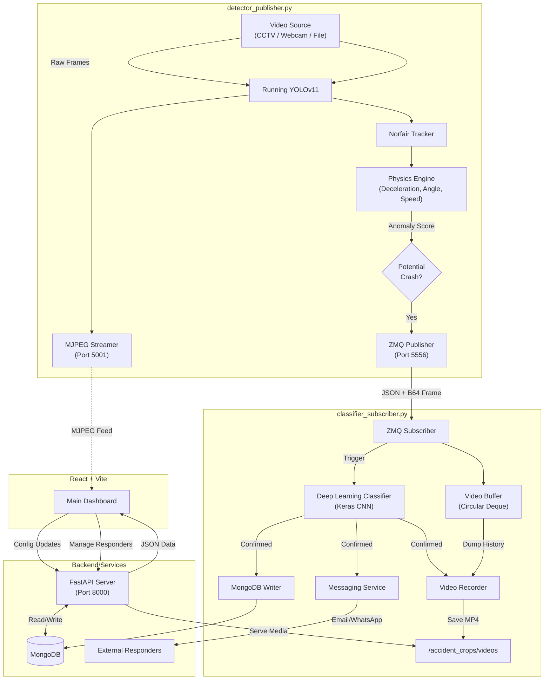

# System Architecture & Data Flow

This document details the modules and data flow of the Accident Detection System 2.0.

## Detailed Component Breakdown

### 1. Detector (`detector/detector.py`)
The heavy lifter. It doesn't just look for "cars", it looks for "behavior".
*   **Object Detection**: YOLOv11s identifies vehicles.
*   **Tracking**: Norfair assigns IDs to track vehicles across frames.
*   **Physics Engine**:
    *   **Deceleration**: Detects rapid speed drops (braking/impact).
    *   **Angle Change**: Detects sudden rotation or spin-outs.
    *   **Interaction**: Monitors proximity between high-stress objects.
*   **Output**: High-efficiency ZeroMQ messages containing physics data and frame snapshots.

### 2. Subscriber (`classifier_subscriber.py`)
The decision maker and archivist.
*   **Scene Verification**: Uses a custom Keras model to classify the *entire scene* as "Accident" or "Normal", filtering out YOLO false positives.
*   **Evidence Recorder**:
    *   Keeps a rolling buffer of the last ~5 seconds of video.
    *   When an accident is confirmed, it "dumps" this buffer and continues recording for another 5 seconds.
    *   Result: A continuous 10-second MP4 clip capturing the *cause* and *aftermath*.
*   **Data Aggregation**: Groups intermittent detections into single "Alert Events" to keep the database clean.

### 3. Backend API (`services/api_server.py`)
The system brain.
*   **Configuration Hub**: Manages camera settings (ROI, Location) and system flags (AI enabled/disabled).
*   **Responder Manager**: Handles the directory of emergency contacts (police/fire), supporting **Excel import/export** for bulk management.
*   **Media Server**: Proxies video streams and serves high-res snapshots and recorded videos to the frontend.

### 4. Dashboard (`dashboard/`)
The command center.
*   **Visuals**: Precision clock, sensor waveforms, and real-time live feeds.
*   **Controls**: Global system settings, camera-specific toggles, and responder address book.
*   **Playback**: Integrated video player for review of accident footage.
