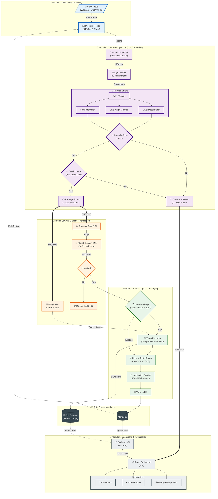

# Master System Diagram

This diagram combines the **Modular Structure** with the **Detailed Data Flow**, with a **Centralized Database Entity**.

```mermaid
flowchart TD
    %% ==========================================
    %% MODULE 1: VIDEO PRE-PROCESSING
    %% ==========================================
    subgraph Mod1 ["🔹 Module 1: Video Pre-processing"]
        direction TB
        Source[/"🎥 Video Input<br>(Webcam / CCTV / File)"/]
        Resize["🖼️ Process: Resize<br>(640x640 & Norm)"]
        
        Source -->|Raw Frame| Resize
    end

    %% ==========================================
    %% MODULE 2: COLLISION DETECTION
    %% ==========================================
    subgraph Mod2 ["🔹 Module 2: Collision Detection (YOLO + Norfair)"]
        direction TB
        YOLO["🧠 Model: YOLOv11<br>(Vehicle Detection)"]
        Tracker["🎯 Algo: Norfair<br>(ID Assignment)"]
        
        subgraph Physics_Engine ["🧮 Physics Engine"]
            Vel["Calc: Velocity"]
            Decel["Calc: Deceleration"]
            Angle["Calc: Angle Change"]
            Interact["Calc: Interaction"]
        end
        
        AnomalyScore{"⚠️ Anomaly Score<br>> 25.0?"}
        CrashCheck{"💥 Crash Check<br>(IoU OR Decel?)"}
        EventPack["📦 Package Event<br>(JSON + Base64)"]
        StreamGen["📺 Generate Stream<br>(MJPEG Frame)"]

        Resize -->|Frame| YOLO
        YOLO -->|BBoxes| Tracker
        Tracker -->|Trajectories| Vel
        Vel --> Decel & Angle & Interact
        Decel & Angle & Interact --> AnomalyScore
        
        %% Flow Logic
        AnomalyScore -- No --> StreamGen
        AnomalyScore -- Yes --> CrashCheck
        CrashCheck -- No --> StreamGen
        CrashCheck -- Yes --> EventPack
    end

    %% ==========================================
    %% MODULE 3: CNN CLASSIFIER (VERIFICATION)
    %% ==========================================
    subgraph Mod3 ["🔹 Module 3: CNN Classifier (Verification)"]
        direction TB
        Buffer["📼 Ring Buffer<br>(5s Pre-Crash)"]
        Crop["✂️ Process: Crop ROI"]
        CNN["🧠 Model: Custom CNN<br>(16-32-16 Filters)"]
        Verify{"✅ Verified?"}
        Discard["🗑️ Discard False Pos"]
        
        EventPack ==>|ZMQ SUB| Crop
        EventPack ==>|ZMQ SUB| Buffer
        Crop -->|Image| CNN
        CNN -->|Prob > 0.8| Verify
        
        Verify -- No --> Discard
    end

    %% ==========================================
    %% MODULE 4: ALERT LOGIC & MESSAGING
    %% ==========================================
    subgraph Mod4 ["🔹 Module 4: Alert Logic & Messaging"]
        direction TB
        Grouping{"🗂️ Grouping Logic<br>(Is active alert < 10s?)"}
        Recorder["🔴 Video Recorder<br>(Dump Buffer + 5s Post)"]
        LPR["🔍 License Plate Recog<br>(EasyOCR / YOLO)"]
        NotifySys["📲 Notification Service<br>(Email / WhatsApp)"]
        UpdateDB["📝 Write to DB"]

        Verify -- Yes --> Grouping
        
        %% Alert Paths
        Grouping -- New --> Recorder
        Recorder --> LPR
        Grouping -- Existing --> LPR
        
        LPR --> NotifySys
        NotifySys --> UpdateDB
        
        Buffer -.->|Dump History| Recorder
    end

    %% ==========================================
    %% MODULE 5: DASHBOARD & VISUALIZATION
    %% ==========================================
    subgraph Mod5 ["🔹 Module 5: Dashboard & Visualization"]
        direction TB
        API["🚀 Backend API<br>(FastAPI)"]
        Frontend["💻 React Dashboard<br>(Vite)"]
        
        StreamGen ==>|Port 5001| Frontend
        API <-->|JSON Data| Frontend
        
        subgraph UI_Features ["User Actions"]
            AlertCard["🚨 View Alerts"]
            Playback["▶️ Video Replay"]
            Responders["🚑 Manage Responders"]
        end
        Frontend --- AlertCard & Playback & Responders
    end

    %% ==========================================
    %% DATA PERSISTENCE LAYER (SEPARATE ENTITY)
    %% ==========================================
    subgraph Persistence ["💾 Data Persistence Layer"]
        direction TB
        Mongo[(MongoDB)]
        Disk[("📂 Disk Storage<br>(Videos / Crops)")]
    end

    %% ==========================================
    %% CROSS-MODULE CONNECTIONS TO DB
    %% ==========================================
    
    %% Mod1 Polls Config
    Mongo -.->|Poll Settings| Resize
    
    %% Mod4 Writes Data
    UpdateDB --> Mongo
    Recorder -->|Save MP4| Disk
    
    %% Mod5 Reads/Writes Data
    Mongo <-->|Query/Write| API
    Disk -.->|Serve Media| API

    %% Styling
    classDef m1 fill:#e3f2fd,stroke:#1565c0,stroke-width:2px;
    classDef m2 fill:#f3e5f5,stroke:#4a148c,stroke-width:2px;
    classDef m3 fill:#fff3e0,stroke:#e65100,stroke-width:2px;
    classDef m4 fill:#e8f5e9,stroke:#2e7d32,stroke-width:2px;
    classDef m5 fill:#eceff1,stroke:#37474f,stroke-width:2px;
    classDef db fill:#37474f,stroke:#263238,stroke-width:2px,color:#fff;

    class Source,Resize m1;
    class YOLO,Tracker,Physics_Engine,Vel,Decel,Angle,Interact,AnomalyScore,CrashCheck,EventPack,StreamGen m2;
    class Buffer,Crop,CNN,Verify,Discard m3;
    class Grouping,LPR,Recorder,NotifySys,UpdateDB m4;
    class API,Frontend,UI_Features,AlertCard,Playback,Responders m5;
    class Mongo,Disk db;
```
